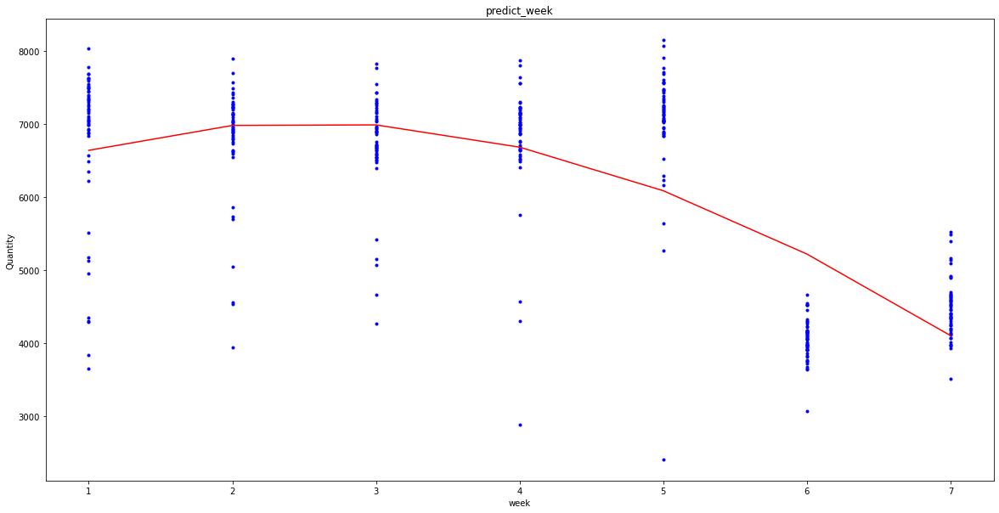

本题代码显示的思路是通过机器学习，线性回归一天预测曲线。更多思考，请参见论文，论文提供多种模型假设，且分析更为深入。此处只用于可视化展示。

## 调用相关库


```python
import numpy as np
import pandas as pd
from pandas import Series,DataFrame
import matplotlib.pyplot as plt
from sklearn.linear_model import LinearRegression
from sklearn.preprocessing import PolynomialFeatures
from numpy import genfromtxt
plt.rcParams['figure.figsize'] = (20.0,10.0)
```

## 读取第一问已经得出的数据


```python
df2018n = pd.read_excel('df2018n_data.xlsx')
```

## 查看读取是否成功


```python
df2018n.shape
```


    (365, 13)


## 手动输入2018年所有的星期一日期，随后利用函数得出周二到周日的日期


```python
def day_add1(list):
    for i in range(len(list)):
        list[i]=list[i] + 1
    return list
```


```python
Monday = [20180101,20180108,20180115,20180122,20180129,
          20180205,20180212,20180219,20180226,
          20180305,20180312,20180319,20180326,
          20180402,20180409,20180416,20180423,20180430,
          20180507,20180514,20180521,20180528,
          20180604,20180611,20180618,20180625,
          20180702,20180709,20180716,20180723,20180730,
          20180806,20180813,20180820,20180827,
          20180903,20180910,20180917,20180924,
          20181001,20181008,20181015,20181022,20181029,
          20181105,20181112,20181119,20181126,
          20181203,20181210,20181217,20181224,20181231]
Tuesday = [20180102,20180109,20180116,20180123,20180130,
           20180206,20180213,20180220,20180227,
           20180306,20180313,20180320,20180327,
           20180403,20180410,20180417,20180424,
           20180501,20180508,20180515,20180522,20180529,
           20180605,20180612,20180619,20180626,
           20180703,20180710,20180717,20180724,20180731,
           20180807,20180814,20180821,20180828,
           20180904,20180911,20180918,20180925,
           20181002,20181009,20181016,20181023,20181030,
           20181106,20181113,20181120,20181127,
           20181204,20181211,20181218,20181225]
Wendnesday = [20180103,20180110,20180117,20180124,20180131,
              20180207,20180214,20180221,20180228,
              20180307,20180314,20180321,20180328,
              20180404,20180411,20180418,20180425,
              20180502,20180509,20180516,20180523,20180530,
              20180606,20180613,20180620,20180627,
              20180704,20180711,20180718,20180725,
              20180801,20180808,20180815,20180822,20180829,
              20180905,20180912,20180919,20180926,
              20181003,20181010,20181017,20181024,20181031,
              20181107,20181114,20181121,20181128,
              20181205,20181212,20181219,20181226]
Thursday = [20180104,20180111,20180118,20180125,
            20180201,20180208,20180215,20180222,
            20180301,20180308,20180315,20180322,20180329,
            20180405,20180412,20180419,20180426,
            20180503,20180510,20180517,20180524,20180531,
            20180607,20180614,20180621,20180628,
            20180705,20180712,20180719,20180726,
            20180802,20180809,20180816,20180823,20180830,
            20180906,20180913,20180920,20180927,
            20181004,20181011,20181018,20181025,
            20181101,20181108,20181115,20181122,20181129,
            20181206,20181213,20181220,20181227]
Friday = [20180105,20180112,20180119,20180126,
          20180202,20180209,20180216,20180223,
          20180302,20180309,20180316,20180323,20180330,
          20180406,20180413,20180420,20180427,
          20180504,20180511,20180518,20180525,
          20180601,20180608,20180615,20180622,20180629,
          20180706,20180713,20180720,20180727,
          20180803,20180810,20180817,20180824,20180831,
          20180907,20180914,20180921,20180928,
          20181005,20181012,20181019,20181026,
          20181102,20181109,20181116,20181123,20181130,
          20181207,20181214,20181221,20181228]
Saturday = [20180106,20180113,20180120,20180127,
            20180203,20180210,20180217,20180224,
            20180303,20180310,20180317,20180324,20180331,
            20180407,20180414,20180421,20180428,
            20180505,20180512,20180519,20180526,
            20180602,20180609,20180616,20180623,20180630,
            20180707,20180714,20180721,20180728,
            20180804,20180811,20180818,20180825,
            20180901,20180908,20180915,20180922,20180929,
            20181006,20181013,20181020,20181027,
            20181103,20181110,20181117,20181124,20181131,
            20181208,20181215,20181222,20181229]
Sunday =[20180107,20180114,20180121,20180128,
         20180204,20180211,20180218,20180225,
         20180304,20180311,20180318,20180325,
         20180401,20180408,20180415,20180422,20180429,
         20180506,20180513,20180520,20180527,
         20180603,20180610,20180617,20180624,
         20180701,20180708,20180715,20180722,20180729,
         20180805,20180812,20180819,20180826,
         20180902,20180909,20180916,20180923,20180930,
         20181007,20181014,20181021,20181028,
         20181104,20181111,20181118,20181125,
         20181201,20181209,20181216,20181223,20181230]
```

## 将数据处理成可供学习的数据结构，此处我们只可视化入境，出境思路一致，就略去。


```python
df2018n_Monday=df2018n[df2018n['Date'].isin(Monday)]
df2018n_Monday = df2018n_Monday.fillna(0)
```


```python
sum_Monday = df2018n_Monday['5-1-41']+df2018n_Monday['5-1-42']+df2018n_Monday['5-1-43']+df2018n_Monday['6-1-41']+df2018n_Monday['6-1-42']+df2018n_Monday['6-1-43']
Mon = DataFrame(sum_Monday)
Mon.insert(0,'week',1)
Mon.rename(columns = {0:'Quantity'})
Mon.head()
```


<div>
<style scoped>
    .dataframe tbody tr th:only-of-type {
        vertical-align: middle;
    }

    .dataframe tbody tr th {
        vertical-align: top;
    }
    
    .dataframe thead th {
        text-align: right;
    }
</style>
<table border="1" class="dataframe">
  <thead>
    <tr style="text-align: right;">
      <th></th>
      <th>week</th>
      <th>0</th>
    </tr>
  </thead>
  <tbody>
    <tr>
      <th>0</th>
      <td>1</td>
      <td>3838.0</td>
    </tr>
    <tr>
      <th>7</th>
      <td>1</td>
      <td>7274.0</td>
    </tr>
    <tr>
      <th>14</th>
      <td>1</td>
      <td>7683.0</td>
    </tr>
    <tr>
      <th>21</th>
      <td>1</td>
      <td>7549.0</td>
    </tr>
    <tr>
      <th>28</th>
      <td>1</td>
      <td>7630.0</td>
    </tr>
  </tbody>
</table>
</div>


```python

```


```python
df2018n_Tuesday=df2018n[df2018n['Date'].isin(Tuesday)]
df2018n_Tuesday = df2018n_Tuesday.fillna(0)
```


```python
sum_Tuesday = df2018n_Tuesday['5-1-41']+df2018n_Tuesday['5-1-42']+df2018n_Tuesday['5-1-43']+df2018n_Tuesday['6-1-41']+df2018n_Tuesday['6-1-42']+df2018n_Tuesday['6-1-43']
Tue = DataFrame(sum_Tuesday)
Tue.insert(0,'week',2)
Tue.rename(columns = {0:'Quantity'})
Tue.head()
```


<div>
<style scoped>
    .dataframe tbody tr th:only-of-type {
        vertical-align: middle;
    }

    .dataframe tbody tr th {
        vertical-align: top;
    }
    
    .dataframe thead th {
        text-align: right;
    }
</style>
<table border="1" class="dataframe">
  <thead>
    <tr style="text-align: right;">
      <th></th>
      <th>week</th>
      <th>0</th>
    </tr>
  </thead>
  <tbody>
    <tr>
      <th>1</th>
      <td>2</td>
      <td>6594.0</td>
    </tr>
    <tr>
      <th>8</th>
      <td>2</td>
      <td>6931.0</td>
    </tr>
    <tr>
      <th>15</th>
      <td>2</td>
      <td>7264.0</td>
    </tr>
    <tr>
      <th>22</th>
      <td>2</td>
      <td>7281.0</td>
    </tr>
    <tr>
      <th>29</th>
      <td>2</td>
      <td>7694.0</td>
    </tr>
  </tbody>
</table>
</div>


```python
df2018n_Wendnesday=df2018n[df2018n['Date'].isin(Wendnesday)]
df2018n_Wendnesday= df2018n_Wendnesday.fillna(0)
```


```python
sum_Wendnesday = df2018n_Wendnesday['5-1-41']+df2018n_Wendnesday['5-1-42']+df2018n_Wendnesday['5-1-43']+df2018n_Wendnesday['6-1-41']+df2018n_Wendnesday['6-1-42']+df2018n_Wendnesday['6-1-43']
Wed = DataFrame(sum_Wendnesday)
Wed.insert(0,'week',3)
Wed.rename(columns = {0:'Quantity'})
Wed.head()
```


<div>
<style scoped>
    .dataframe tbody tr th:only-of-type {
        vertical-align: middle;
    }

    .dataframe tbody tr th {
        vertical-align: top;
    }
    
    .dataframe thead th {
        text-align: right;
    }
</style>
<table border="1" class="dataframe">
  <thead>
    <tr style="text-align: right;">
      <th></th>
      <th>week</th>
      <th>0</th>
    </tr>
  </thead>
  <tbody>
    <tr>
      <th>2</th>
      <td>3</td>
      <td>6586.0</td>
    </tr>
    <tr>
      <th>9</th>
      <td>3</td>
      <td>6644.0</td>
    </tr>
    <tr>
      <th>16</th>
      <td>3</td>
      <td>7251.0</td>
    </tr>
    <tr>
      <th>23</th>
      <td>3</td>
      <td>7282.0</td>
    </tr>
    <tr>
      <th>30</th>
      <td>3</td>
      <td>7550.0</td>
    </tr>
  </tbody>
</table>
</div>


```python
df2018n_Thursday=df2018n[df2018n['Date'].isin(Thursday)]
df2018n_Thursday= df2018n_Thursday.fillna(0)
```


```python
sum_Thursday = df2018n_Thursday['5-1-41']+df2018n_Thursday['5-1-42']+df2018n_Thursday['5-1-43']+df2018n_Thursday['6-1-41']+df2018n_Thursday['6-1-42']+df2018n_Thursday['6-1-43']
Thu = DataFrame(sum_Thursday)
Thu.insert(0,'week',4)
Thu.rename(columns = {0:'Quantity'})
Thu.head()
```


<div>
<style scoped>
    .dataframe tbody tr th:only-of-type {
        vertical-align: middle;
    }

    .dataframe tbody tr th {
        vertical-align: top;
    }
    
    .dataframe thead th {
        text-align: right;
    }
</style>
<table border="1" class="dataframe">
  <thead>
    <tr style="text-align: right;">
      <th></th>
      <th>week</th>
      <th>0</th>
    </tr>
  </thead>
  <tbody>
    <tr>
      <th>3</th>
      <td>4</td>
      <td>6864.0</td>
    </tr>
    <tr>
      <th>10</th>
      <td>4</td>
      <td>7097.0</td>
    </tr>
    <tr>
      <th>17</th>
      <td>4</td>
      <td>7057.0</td>
    </tr>
    <tr>
      <th>24</th>
      <td>4</td>
      <td>7222.0</td>
    </tr>
    <tr>
      <th>31</th>
      <td>4</td>
      <td>7560.0</td>
    </tr>
  </tbody>
</table>
</div>


```python
df2018n_Friday=df2018n[df2018n['Date'].isin(Friday)]
df2018n_Friday= df2018n_Friday.fillna(0)
```


```python
sum_Friday = df2018n_Friday['5-1-41']+df2018n_Friday['5-1-42']+df2018n_Friday['5-1-43']+df2018n_Friday['6-1-41']+df2018n_Friday['6-1-42']+df2018n_Friday['6-1-43']
Fri = DataFrame(sum_Friday)
Fri.insert(0,'week',5)
Fri.rename(columns = {0:'Quantity'})
Fri.shape
```


    (52, 2)


```python
df2018n_Saturday=df2018n[df2018n['Date'].isin(Saturday)]
df2018n_Saturday= df2018n_Saturday.fillna(0)
```


```python
sum_Saturday = df2018n_Saturday['5-1-41']+df2018n_Saturday['5-1-42']+df2018n_Saturday['5-1-43']
Sat = DataFrame(sum_Saturday)
Sat.insert(0,'week',6)
Sat.rename(columns = {0:'Quantity'})
Sat.shape
```


    (51, 2)


```python
df2018n_Sunday=df2018n[df2018n['Date'].isin(Sunday)]
df2018n_Sunday= df2018n_Sunday.fillna(0)
```


```python
sum_Sunday = df2018n_Sunday['5-1-41']+df2018n_Sunday['5-1-42']+df2018n_Sunday['5-1-43']+df2018n_Sunday['6-1-41']+df2018n_Sunday['6-1-42']+df2018n_Sunday['6-1-43']
Sun = DataFrame(sum_Sunday)
Sun.insert(0,'week',7)
Sun.rename(columns = {0:'Quantity'})
Sun.shape
```


    (52, 2)


## 合并周日到周日的数据，并修改索引


```python
Week = pd.concat([Mon,Tue,Wed,Thu,Fri,Sat,Sun])
Week = Week.rename(columns = {0:'Quantity'})
Week.index = range(len(Week))
```

## 生成csv文件


```python
Week.to_csv('Week.csv')
```

##  导入数据，确定x_data,y_data，并可视化结果。（不难看出，我们应该剔除一些有误数据，但时间有限，暂不剔除）


```python
# 加载数据
data = genfromtxt("Week.csv", delimiter=",")
x_data = data[1:, 1]
y_data = data[1:, 2]
plt.scatter(x_data, y_data)
plt.show()
# print(x_data, y_data)
```


​    

​    


## 生成一次函数，看看走势。


```python
# 一维变二维
x_data = x_data[:,np.newaxis]
y_data = y_data[:,np.newaxis]

# 创建并拟合模型
model = LinearRegression()
model.fit(x_data, y_data)

plt.scatter(x_data, y_data)
plt.plot(x_data, model.predict(x_data), 'r')
plt.show()
```


​    

​    


## 多项式回归，此后，如果得知某天为周几，那么我们有自信说，该天的通行量在回归量附近。


```python
# 定义多项式回归, degree的值可以调节多项式的特征
poly_reg = PolynomialFeatures(degree=3)
# 特征处理
x_poly = poly_reg.fit_transform(x_data)

# 定义回归模型
reg = LinearRegression()
reg.fit(x_poly, y_data)

plt.plot(x_data, y_data, 'b.')
plt.plot(x_data, reg.predict(x_poly), 'r')
plt.xlabel('week')
plt.ylabel('Quantity')
plt.title('predict_week')
plt.show()
```


​    

​    


# 接下来，我们分析每天对应时刻的通行量数据

## 导入数据 此处仅处理四月数据


```python
df201804t = pd.read_excel('df201804t_data.xlsx')
```


```python
df201804t['Date'].tolist()
```


```python
df201804t = df201804t.fillna(0)
def get_hour(s):
    list = s.tolist()
    for i in range(len(list)):
        list[i] = int(round(round(list[i]/100,2)-float(int(round(list[i]/100,2))),2)*100)
    return list
```


```python
list = get_hour(df201804t['Date'])
```


```python
s4 = df201804t['5-1-41']+df201804t['5-1-42']+df201804t['5-1-43']+df201804t['6-1-41']+df201804t['6-1-42']+df201804t['6-1-43']
```


```python
df_4hour = DataFrame([list,s4.tolist()],index=['hour','Quantity']).T
df_4hour.drop(index = df[df['hour']==0].index,inplace=True)#剔除ToolType的冗余项
df_4hour
```

```python
g_4hour = df_4hour.groupby(['hour'])
g_4hour.groups
```


```python
g6 = g_4hour.get_group(6)
g7 = g_4hour.get_group(7)
g8 = g_4hour.get_group(8)
g9 = g_4hour.get_group(9)
g10 = g_4hour.get_group(10)
g11 = g_4hour.get_group(11)
g12 = g_4hour.get_group(12)
g13 = g_4hour.get_group(13)
g14 = g_4hour.get_group(14)
g15 = g_4hour.get_group(15)
g16 = g_4hour.get_group(16)
g17 = g_4hour.get_group(17)
g18 = g_4hour.get_group(18)
g19 = g_4hour.get_group(19)
g20 = g_4hour.get_group(20)
g21 = g_4hour.get_group(21)
g22 = g_4hour.get_group(22)
g23 = g_4hour.get_group(23)
```


```python
g = pd.concat([g6,g7,g8,g9,g10,g11,g12,g13,g14,g15,g16,g17,g18,g19,g20,g21,g22,g23])
```


```python
list = df201804t['Date'].tolist()
```


```python
M4 = DataFrame(s4)
M4.insert(0,'time',list)
M4.rename(columns = {0:'Quantity'})
```


<div>
<style scoped>
    .dataframe tbody tr th:only-of-type {
        vertical-align: middle;
    }

    .dataframe tbody tr th {
        vertical-align: top;
    }
    
    .dataframe thead th {
        text-align: right;
    }
</style>
<table border="1" class="dataframe">
  <thead>
    <tr style="text-align: right;">
      <th></th>
      <th>time</th>
      <th>Quantity</th>
    </tr>
  </thead>
  <tbody>
    <tr>
      <th>0</th>
      <td>2018040106</td>
      <td>51.0</td>
    </tr>
    <tr>
      <th>1</th>
      <td>2018040107</td>
      <td>133.0</td>
    </tr>
    <tr>
      <th>2</th>
      <td>2018040108</td>
      <td>229.0</td>
    </tr>
    <tr>
      <th>3</th>
      <td>2018040109</td>
      <td>306.0</td>
    </tr>
    <tr>
      <th>4</th>
      <td>2018040110</td>
      <td>288.0</td>
    </tr>
    <tr>
      <th>...</th>
      <td>...</td>
      <td>...</td>
    </tr>
    <tr>
      <th>539</th>
      <td>2018043019</td>
      <td>375.0</td>
    </tr>
    <tr>
      <th>540</th>
      <td>2018043020</td>
      <td>389.0</td>
    </tr>
    <tr>
      <th>541</th>
      <td>2018043021</td>
      <td>364.0</td>
    </tr>
    <tr>
      <th>542</th>
      <td>2018043022</td>
      <td>281.0</td>
    </tr>
    <tr>
      <th>543</th>
      <td>2018043023</td>
      <td>115.0</td>
    </tr>
  </tbody>
</table>
<p>544 rows × 2 columns</p>
</div>


## 数据处理完后，我们重复上面步骤


```python
g.to_csv('M4.csv')
```


```python
# 加载数据
data = genfromtxt("M4.csv", delimiter=",")
x_data = data[1:, 1]
y_data = data[1:, 2]
plt.scatter(x_data, y_data)
plt.show()
# print(x_data, y_data)
```


​    

​    


## 看看走势


```python
# 一维变二维
x_data = x_data[:,np.newaxis]
y_data = y_data[:,np.newaxis]

# 创建并拟合模型
model = LinearRegression()
model.fit(x_data, y_data)

plt.scatter(x_data, y_data)
plt.plot(x_data, model.predict(x_data), 'r')
plt.show()
```


​    

​    


## 以下是18年4月每一天6-23h拟合出的回归线，数据没有采用更多，数据增多并剔除有误项，得到的回归线可以使我们有自信说，该天某一个时刻的通量在回归量附近。


```python
# 定义多项式回归, degree的值可以调节多项式的特征
poly_reg = PolynomialFeatures(degree=3)
# 特征处理
x_poly = poly_reg.fit_transform(x_data)

# 定义回归模型
reg = LinearRegression()
reg.fit(x_poly, y_data)

plt.plot(x_data, y_data, 'b.')
plt.plot(x_data, reg.predict(x_poly), 'r')
plt.xlabel('hour')
plt.ylabel('Quantity')
plt.title('predict_hour')
plt.show()
```


    


## 重庆邮电大学2021数模A题第二问 有关python数据回归及可视化的分析 代码编写：江佳骏