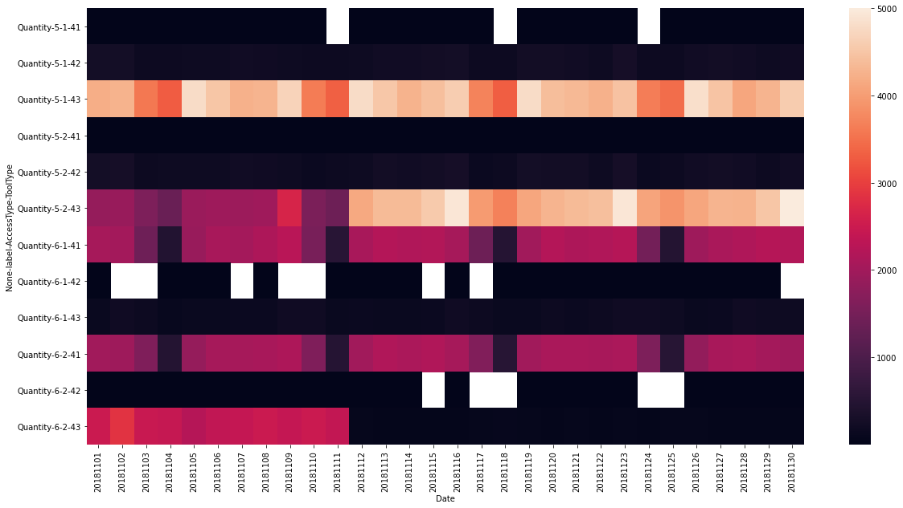
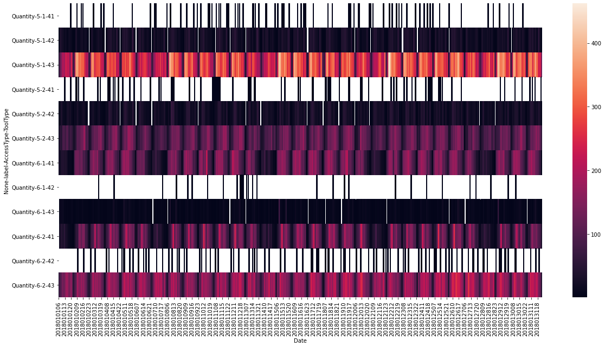

```python
#导入数据分析相关库
import numpy as np
import pandas as pd
from pandas import Series,DataFrame
import matplotlib.pyplot as plt
import seaborn as sns
#设置幕布大小
plt.rcParams['figure.figsize'] = (20.0,10.0)
```

# 数据处理相关函数


```python
#函数说明
#输入：df_init(导入文件DataFrame) 输入：df（出除无关列数据DataFrame）
#用途：生成df，以便后续函数处理
def df_init(df_init):
    df = df_init.drop(df_init.columns[[1,2,3,4,5,7,8]],axis = 1)
    return df
```


```python
#函数说明
#输入：df的出入时间 输出：df的出入日期（相当于去掉秒分时）
#用途：用于Data_init_day(df)函数，使df['出入时间'].map()可调用
def ConvertToDay(time):
    return int(time/1000000)
```


```python
#函数说明
#输入：df的出入时间 输出：df的出入小时（相当于去掉秒分）
#用途：用于Data_init_Hour(df)函数，使df['出入时间'].map()可调用
def ConvertToHour(time):
    return int(time/10000)
```


```python
#函数说明
#输入：原始df 输出：数据初始化后的dfn
#用途：由于原始数据含有少数冗余数据，需要剔除冗余数据以便于数据分析
def Data_init_day(df):
    s = df['出入时间'].map(ConvertToDay).tolist()#通过map，修改出入时间为出入日期，并将Series转换为list
    df.insert(0,'出入日期',s)#通过insert，插入一列新数据，数据column名为‘出入日期’
    df = df.drop(df.columns[3],axis = 1)#删除原来的‘出入日期’，注意如果反复使用该函数，需要初始化df
    df = df.rename(columns = {'出入日期':'Date','工具类型':'ToolType','出入类型':'AccessType','验放标志':'label'})#传入字典，修改列名
    df.drop(index = df[df['ToolType']>43].index,inplace=True)#剔除ToolType的冗余项
    df.drop(index = df[df['label']>6].index,inplace=True)#剔除label的冗余项
    df.drop(index = df[df['label']<5].index,inplace=True)#剔除label的冗余项
    s = df.value_counts(sort=False)#生成多级Series，统计每种类型搭配的数量
    dfn = DataFrame(s)#根据多级Series生成dfn，dfn为透视表
    dfn = dfn.rename(columns = {0:'Quantity'})#将统计数量column命名为Quantity
    dfn = dfn.unstack().unstack().unstack()#多级DataFrame降维
    return dfn
```


```python
#函数说明
#输入：原始df 输出：数据初始化后的dft
#用途：由于原始数据含有少数冗余数据，需要剔除冗余数据以便于数据分析
#与Data_init_day的区别：仅将ConvertToDay替换为ConvertToHour
def Data_init_Hour(df):
    s = df['出入时间'].map(ConvertToHour).tolist()
    df.insert(0,'出入日期',s)
    df = df.drop(df.columns[3],axis = 1)
    df = df.rename(columns = {'出入日期':'Date','工具类型':'ToolType','出入类型':'AccessType','验放标志':'label'})#传入字典
    df.drop(index = df[df['ToolType']>43].index,inplace=True)
    df.drop(index = df[df['label']>6].index,inplace=True)
    df.drop(index = df[df['label']<5].index,inplace=True)
    s = df.value_counts(sort=False)
    dft = DataFrame(s)
    dft = dft.rename(columns = {0:'Quantity'})
    dft = dft.unstack().unstack().unstack()
    return dft
```

# 文件导入


```python
#我将一个文件的多个sheet拆分为多个excel，然后读入
#如果直接读入，会使得程序读入较慢，直接读入代码df_init = pd.read_excel('A题附件2：出行车辆数据明细',sheet_name = 2018..)
#注意ipyon文件必须和待读入文件在同一目录下才能直接以文件名作为路径，否则需要填写相对路径或绝对路径
df201801_init = pd.read_excel('201801.xlsx')
df201802_init = pd.read_excel('201802.xlsx')
df201803_init = pd.read_excel('201803.xlsx')
df201804_init = pd.read_excel('201804.xlsx')
df201805_init = pd.read_excel('201805.xlsx')
df201806_init = pd.read_excel('201806.xlsx')
df201807_init = pd.read_excel('201807.xlsx')
df201808_init = pd.read_excel('201808.xlsx')
df201809_init = pd.read_excel('201809.xlsx')
df201810_init = pd.read_excel('201810.xlsx')
df201811_init = pd.read_excel('201811.xlsx')
df201812_init = pd.read_excel('201812.xlsx')
```


```python
df201801_init.head()#查看文件导入是否成功
```


<div>
<style scoped>
    .dataframe tbody tr th:only-of-type {
        vertical-align: middle;
    }

    .dataframe tbody tr th {
        vertical-align: top;
    }

    .dataframe thead th {
        text-align: right;
    }
</style>
<table border="1" class="dataframe">
  <thead>
    <tr style="text-align: right;">
      <th></th>
      <th>工具类型</th>
      <th>航次</th>
      <th>境外标识</th>
      <th>境内标志</th>
      <th>出入口岸</th>
      <th>通道号</th>
      <th>出入类型</th>
      <th>验放部门</th>
      <th>检查员</th>
      <th>出入时间</th>
      <th>验放标志</th>
    </tr>
  </thead>
  <tbody>
    <tr>
      <th>0</th>
      <td>41</td>
      <td>UW3018</td>
      <td>UW3018</td>
      <td>粤Z.****港</td>
      <td>492</td>
      <td>Z517</td>
      <td>1</td>
      <td>492108</td>
      <td>44969</td>
      <td>20180101063226</td>
      <td>6</td>
    </tr>
    <tr>
      <th>1</th>
      <td>43</td>
      <td>RR4055</td>
      <td>RR4055</td>
      <td>粤B6****G</td>
      <td>492</td>
      <td>Z434</td>
      <td>2</td>
      <td>492105</td>
      <td>46083</td>
      <td>20180101063231</td>
      <td>6</td>
    </tr>
    <tr>
      <th>2</th>
      <td>43</td>
      <td>FV851</td>
      <td>FV851</td>
      <td>粤Z.****港</td>
      <td>492</td>
      <td>Z433</td>
      <td>2</td>
      <td>492105</td>
      <td>44956</td>
      <td>20180101063246</td>
      <td>6</td>
    </tr>
    <tr>
      <th>3</th>
      <td>41</td>
      <td>UD3418</td>
      <td>UD3418</td>
      <td>粤B8****S</td>
      <td>492</td>
      <td>Z518</td>
      <td>1</td>
      <td>492108</td>
      <td>44969</td>
      <td>20180101063310</td>
      <td>6</td>
    </tr>
    <tr>
      <th>4</th>
      <td>43</td>
      <td>FV1646</td>
      <td>FV1646</td>
      <td>粤K3****8</td>
      <td>492</td>
      <td>Z422</td>
      <td>2</td>
      <td>492105</td>
      <td>42792</td>
      <td>20180101063342</td>
      <td>5</td>
    </tr>
  </tbody>
</table>
</div>


# 调用函数处理df_init,并导出透视表excel


```python
#初始化
df201801 = df_init(df201801_init)
df201802 = df_init(df201802_init)
df201803 = df_init(df201803_init)
df201804 = df_init(df201804_init)
df201805 = df_init(df201805_init)
df201806 = df_init(df201806_init)
df201807 = df_init(df201807_init)
df201808 = df_init(df201808_init)
df201809 = df_init(df201809_init)
df201810 = df_init(df201810_init)
df201811 = df_init(df201811_init)
df201812 = df_init(df201812_init)
```


```python
df201801#查看函数使用成功与否
```


<div>
<style scoped>
    .dataframe tbody tr th:only-of-type {
        vertical-align: middle;
    }

    .dataframe tbody tr th {
        vertical-align: top;
    }

    .dataframe thead th {
        text-align: right;
    }
</style>
<table border="1" class="dataframe">
  <thead>
    <tr style="text-align: right;">
      <th></th>
      <th>工具类型</th>
      <th>出入类型</th>
      <th>出入时间</th>
      <th>验放标志</th>
    </tr>
  </thead>
  <tbody>
    <tr>
      <th>0</th>
      <td>41</td>
      <td>1</td>
      <td>20180101063226</td>
      <td>6</td>
    </tr>
    <tr>
      <th>1</th>
      <td>43</td>
      <td>2</td>
      <td>20180101063231</td>
      <td>6</td>
    </tr>
    <tr>
      <th>2</th>
      <td>43</td>
      <td>2</td>
      <td>20180101063246</td>
      <td>6</td>
    </tr>
    <tr>
      <th>3</th>
      <td>41</td>
      <td>1</td>
      <td>20180101063310</td>
      <td>6</td>
    </tr>
    <tr>
      <th>4</th>
      <td>43</td>
      <td>2</td>
      <td>20180101063342</td>
      <td>5</td>
    </tr>
    <tr>
      <th>...</th>
      <td>...</td>
      <td>...</td>
      <td>...</td>
      <td>...</td>
    </tr>
    <tr>
      <th>417830</th>
      <td>43</td>
      <td>2</td>
      <td>20180131235000</td>
      <td>5</td>
    </tr>
    <tr>
      <th>417831</th>
      <td>43</td>
      <td>1</td>
      <td>20180131235012</td>
      <td>5</td>
    </tr>
    <tr>
      <th>417832</th>
      <td>41</td>
      <td>2</td>
      <td>20180131235244</td>
      <td>6</td>
    </tr>
    <tr>
      <th>417833</th>
      <td>43</td>
      <td>2</td>
      <td>20180131235445</td>
      <td>5</td>
    </tr>
    <tr>
      <th>417834</th>
      <td>41</td>
      <td>2</td>
      <td>20180131235713</td>
      <td>6</td>
    </tr>
  </tbody>
</table>
<p>417835 rows × 4 columns</p>
</div>


```python
#生成透视表（如果不小心多点了一次，就得重新初始化，再调用这个函数了哦）
df201801n = Data_init_day(df201801)
df201802n = Data_init_day(df201802)
df201803n = Data_init_day(df201803)
df201804n = Data_init_day(df201804)
df201805n = Data_init_day(df201805)
df201806n = Data_init_day(df201806)
df201807n = Data_init_day(df201807)
df201808n = Data_init_day(df201808)
df201809n = Data_init_day(df201809)
df201810n = Data_init_day(df201810)
df201811n = Data_init_day(df201811)
df201812n = Data_init_day(df201812)
```


```python
df201801n#查看函数使用成功与否
```


<div>
<style scoped>
    .dataframe tbody tr th:only-of-type {
        vertical-align: middle;
    }

    .dataframe tbody tr th {
        vertical-align: top;
    }

    .dataframe thead tr th {
        text-align: left;
    }

    .dataframe thead tr:last-of-type th {
        text-align: right;
    }
</style>
<table border="1" class="dataframe">
  <thead>
    <tr>
      <th></th>
      <th colspan="12" halign="left">Quantity</th>
    </tr>
    <tr>
      <th>label</th>
      <th colspan="6" halign="left">5</th>
      <th colspan="6" halign="left">6</th>
    </tr>
    <tr>
      <th>AccessType</th>
      <th colspan="3" halign="left">1</th>
      <th colspan="3" halign="left">2</th>
      <th colspan="3" halign="left">1</th>
      <th colspan="3" halign="left">2</th>
    </tr>
    <tr>
      <th>ToolType</th>
      <th>41</th>
      <th>42</th>
      <th>43</th>
      <th>41</th>
      <th>42</th>
      <th>43</th>
      <th>41</th>
      <th>42</th>
      <th>43</th>
      <th>41</th>
      <th>42</th>
      <th>43</th>
    </tr>
    <tr>
      <th>Date</th>
      <th></th>
      <th></th>
      <th></th>
      <th></th>
      <th></th>
      <th></th>
      <th></th>
      <th></th>
      <th></th>
      <th></th>
      <th></th>
      <th></th>
    </tr>
  </thead>
  <tbody>
    <tr>
      <th>20180101</th>
      <td>1.0</td>
      <td>303.0</td>
      <td>3071.0</td>
      <td>2.0</td>
      <td>323.0</td>
      <td>1158.0</td>
      <td>430.0</td>
      <td>NaN</td>
      <td>136.0</td>
      <td>397.0</td>
      <td>NaN</td>
      <td>2247.0</td>
    </tr>
    <tr>
      <th>20180102</th>
      <td>3.0</td>
      <td>281.0</td>
      <td>4764.0</td>
      <td>5.0</td>
      <td>290.0</td>
      <td>1799.0</td>
      <td>1688.0</td>
      <td>NaN</td>
      <td>109.0</td>
      <td>1545.0</td>
      <td>2.0</td>
      <td>2354.0</td>
    </tr>
    <tr>
      <th>20180103</th>
      <td>3.0</td>
      <td>264.0</td>
      <td>4463.0</td>
      <td>2.0</td>
      <td>265.0</td>
      <td>1883.0</td>
      <td>1945.0</td>
      <td>1.0</td>
      <td>97.0</td>
      <td>1846.0</td>
      <td>3.0</td>
      <td>2370.0</td>
    </tr>
    <tr>
      <th>20180104</th>
      <td>1.0</td>
      <td>472.0</td>
      <td>4351.0</td>
      <td>5.0</td>
      <td>474.0</td>
      <td>1939.0</td>
      <td>2102.0</td>
      <td>1.0</td>
      <td>146.0</td>
      <td>1991.0</td>
      <td>3.0</td>
      <td>2590.0</td>
    </tr>
    <tr>
      <th>20180105</th>
      <td>1.0</td>
      <td>498.0</td>
      <td>4532.0</td>
      <td>3.0</td>
      <td>471.0</td>
      <td>2157.0</td>
      <td>2205.0</td>
      <td>NaN</td>
      <td>197.0</td>
      <td>2090.0</td>
      <td>5.0</td>
      <td>2842.0</td>
    </tr>
    <tr>
      <th>20180106</th>
      <td>1.0</td>
      <td>373.0</td>
      <td>3708.0</td>
      <td>2.0</td>
      <td>355.0</td>
      <td>1559.0</td>
      <td>1490.0</td>
      <td>NaN</td>
      <td>124.0</td>
      <td>1640.0</td>
      <td>4.0</td>
      <td>2619.0</td>
    </tr>
    <tr>
      <th>20180107</th>
      <td>3.0</td>
      <td>349.0</td>
      <td>3653.0</td>
      <td>2.0</td>
      <td>348.0</td>
      <td>1262.0</td>
      <td>615.0</td>
      <td>1.0</td>
      <td>67.0</td>
      <td>601.0</td>
      <td>2.0</td>
      <td>2837.0</td>
    </tr>
    <tr>
      <th>20180108</th>
      <td>2.0</td>
      <td>414.0</td>
      <td>4927.0</td>
      <td>4.0</td>
      <td>440.0</td>
      <td>1870.0</td>
      <td>1973.0</td>
      <td>1.0</td>
      <td>171.0</td>
      <td>1757.0</td>
      <td>4.0</td>
      <td>2518.0</td>
    </tr>
    <tr>
      <th>20180109</th>
      <td>3.0</td>
      <td>452.0</td>
      <td>4518.0</td>
      <td>2.0</td>
      <td>452.0</td>
      <td>1913.0</td>
      <td>2057.0</td>
      <td>2.0</td>
      <td>123.0</td>
      <td>1806.0</td>
      <td>3.0</td>
      <td>2389.0</td>
    </tr>
    <tr>
      <th>20180110</th>
      <td>4.0</td>
      <td>366.0</td>
      <td>4337.0</td>
      <td>3.0</td>
      <td>367.0</td>
      <td>1905.0</td>
      <td>2009.0</td>
      <td>1.0</td>
      <td>125.0</td>
      <td>1891.0</td>
      <td>4.0</td>
      <td>2487.0</td>
    </tr>
    <tr>
      <th>20180111</th>
      <td>7.0</td>
      <td>462.0</td>
      <td>4546.0</td>
      <td>4.0</td>
      <td>460.0</td>
      <td>2002.0</td>
      <td>2172.0</td>
      <td>1.0</td>
      <td>106.0</td>
      <td>1932.0</td>
      <td>4.0</td>
      <td>2647.0</td>
    </tr>
    <tr>
      <th>20180112</th>
      <td>4.0</td>
      <td>415.0</td>
      <td>4703.0</td>
      <td>2.0</td>
      <td>397.0</td>
      <td>2132.0</td>
      <td>2253.0</td>
      <td>7.0</td>
      <td>182.0</td>
      <td>2086.0</td>
      <td>3.0</td>
      <td>2974.0</td>
    </tr>
    <tr>
      <th>20180113</th>
      <td>4.0</td>
      <td>456.0</td>
      <td>3768.0</td>
      <td>6.0</td>
      <td>430.0</td>
      <td>1624.0</td>
      <td>1631.0</td>
      <td>5.0</td>
      <td>127.0</td>
      <td>1672.0</td>
      <td>4.0</td>
      <td>2546.0</td>
    </tr>
    <tr>
      <th>20180114</th>
      <td>4.0</td>
      <td>351.0</td>
      <td>3649.0</td>
      <td>NaN</td>
      <td>364.0</td>
      <td>1384.0</td>
      <td>650.0</td>
      <td>NaN</td>
      <td>91.0</td>
      <td>639.0</td>
      <td>2.0</td>
      <td>2768.0</td>
    </tr>
    <tr>
      <th>20180115</th>
      <td>4.0</td>
      <td>418.0</td>
      <td>5172.0</td>
      <td>2.0</td>
      <td>442.0</td>
      <td>1949.0</td>
      <td>2148.0</td>
      <td>NaN</td>
      <td>248.0</td>
      <td>1914.0</td>
      <td>2.0</td>
      <td>2543.0</td>
    </tr>
    <tr>
      <th>20180116</th>
      <td>5.0</td>
      <td>465.0</td>
      <td>4729.0</td>
      <td>2.0</td>
      <td>470.0</td>
      <td>1956.0</td>
      <td>2253.0</td>
      <td>NaN</td>
      <td>132.0</td>
      <td>2021.0</td>
      <td>3.0</td>
      <td>2584.0</td>
    </tr>
    <tr>
      <th>20180117</th>
      <td>1.0</td>
      <td>449.0</td>
      <td>4675.0</td>
      <td>2.0</td>
      <td>441.0</td>
      <td>1928.0</td>
      <td>2240.0</td>
      <td>1.0</td>
      <td>114.0</td>
      <td>1935.0</td>
      <td>4.0</td>
      <td>2804.0</td>
    </tr>
    <tr>
      <th>20180118</th>
      <td>2.0</td>
      <td>417.0</td>
      <td>4603.0</td>
      <td>7.0</td>
      <td>406.0</td>
      <td>1966.0</td>
      <td>2204.0</td>
      <td>1.0</td>
      <td>132.0</td>
      <td>2020.0</td>
      <td>4.0</td>
      <td>2826.0</td>
    </tr>
    <tr>
      <th>20180119</th>
      <td>3.0</td>
      <td>439.0</td>
      <td>4749.0</td>
      <td>2.0</td>
      <td>425.0</td>
      <td>2077.0</td>
      <td>2207.0</td>
      <td>2.0</td>
      <td>154.0</td>
      <td>2035.0</td>
      <td>5.0</td>
      <td>3069.0</td>
    </tr>
    <tr>
      <th>20180120</th>
      <td>4.0</td>
      <td>331.0</td>
      <td>4029.0</td>
      <td>3.0</td>
      <td>322.0</td>
      <td>1660.0</td>
      <td>1621.0</td>
      <td>NaN</td>
      <td>134.0</td>
      <td>1700.0</td>
      <td>3.0</td>
      <td>2785.0</td>
    </tr>
    <tr>
      <th>20180121</th>
      <td>2.0</td>
      <td>406.0</td>
      <td>3715.0</td>
      <td>1.0</td>
      <td>441.0</td>
      <td>1421.0</td>
      <td>608.0</td>
      <td>NaN</td>
      <td>87.0</td>
      <td>606.0</td>
      <td>4.0</td>
      <td>2696.0</td>
    </tr>
    <tr>
      <th>20180122</th>
      <td>5.0</td>
      <td>465.0</td>
      <td>5169.0</td>
      <td>3.0</td>
      <td>466.0</td>
      <td>1936.0</td>
      <td>2054.0</td>
      <td>1.0</td>
      <td>130.0</td>
      <td>1799.0</td>
      <td>3.0</td>
      <td>2539.0</td>
    </tr>
    <tr>
      <th>20180123</th>
      <td>2.0</td>
      <td>498.0</td>
      <td>4761.0</td>
      <td>5.0</td>
      <td>496.0</td>
      <td>1924.0</td>
      <td>2090.0</td>
      <td>1.0</td>
      <td>122.0</td>
      <td>1911.0</td>
      <td>3.0</td>
      <td>2713.0</td>
    </tr>
    <tr>
      <th>20180124</th>
      <td>6.0</td>
      <td>437.0</td>
      <td>4760.0</td>
      <td>5.0</td>
      <td>446.0</td>
      <td>1988.0</td>
      <td>2157.0</td>
      <td>1.0</td>
      <td>135.0</td>
      <td>1873.0</td>
      <td>4.0</td>
      <td>2828.0</td>
    </tr>
    <tr>
      <th>20180125</th>
      <td>1.0</td>
      <td>407.0</td>
      <td>4755.0</td>
      <td>4.0</td>
      <td>396.0</td>
      <td>1991.0</td>
      <td>2172.0</td>
      <td>1.0</td>
      <td>125.0</td>
      <td>1921.0</td>
      <td>4.0</td>
      <td>3012.0</td>
    </tr>
    <tr>
      <th>20180126</th>
      <td>2.0</td>
      <td>497.0</td>
      <td>5084.0</td>
      <td>2.0</td>
      <td>479.0</td>
      <td>1993.0</td>
      <td>2233.0</td>
      <td>NaN</td>
      <td>180.0</td>
      <td>2051.0</td>
      <td>4.0</td>
      <td>3493.0</td>
    </tr>
    <tr>
      <th>20180127</th>
      <td>NaN</td>
      <td>336.0</td>
      <td>4316.0</td>
      <td>NaN</td>
      <td>319.0</td>
      <td>1610.0</td>
      <td>1638.0</td>
      <td>2.0</td>
      <td>132.0</td>
      <td>1681.0</td>
      <td>4.0</td>
      <td>3141.0</td>
    </tr>
    <tr>
      <th>20180128</th>
      <td>2.0</td>
      <td>317.0</td>
      <td>4015.0</td>
      <td>NaN</td>
      <td>315.0</td>
      <td>1386.0</td>
      <td>630.0</td>
      <td>1.0</td>
      <td>113.0</td>
      <td>575.0</td>
      <td>3.0</td>
      <td>3180.0</td>
    </tr>
    <tr>
      <th>20180129</th>
      <td>3.0</td>
      <td>377.0</td>
      <td>5301.0</td>
      <td>2.0</td>
      <td>381.0</td>
      <td>1851.0</td>
      <td>2061.0</td>
      <td>1.0</td>
      <td>184.0</td>
      <td>1742.0</td>
      <td>8.0</td>
      <td>2894.0</td>
    </tr>
    <tr>
      <th>20180130</th>
      <td>3.0</td>
      <td>398.0</td>
      <td>5035.0</td>
      <td>4.0</td>
      <td>406.0</td>
      <td>1931.0</td>
      <td>2230.0</td>
      <td>1.0</td>
      <td>139.0</td>
      <td>1848.0</td>
      <td>3.0</td>
      <td>2870.0</td>
    </tr>
    <tr>
      <th>20180131</th>
      <td>NaN</td>
      <td>464.0</td>
      <td>4806.0</td>
      <td>5.0</td>
      <td>456.0</td>
      <td>1965.0</td>
      <td>2171.0</td>
      <td>NaN</td>
      <td>136.0</td>
      <td>1724.0</td>
      <td>3.0</td>
      <td>3002.0</td>
    </tr>
  </tbody>
</table>
</div>


```python
#导出透视表excel，将数据交由合作同学，计算数据的相关性系数
#对于python，亦可以处理相关性系数，参照python的math库
df201801n.to_excel('df201801n_all.xlsx')
df201802n.to_excel('df201802n_all.xlsx')
df201803n.to_excel('df201803n_all.xlsx')
df201804n.to_excel('df201804n_all.xlsx')
df201805n.to_excel('df201805n_all.xlsx')
df201806n.to_excel('df201806n_all.xlsx')
df201807n.to_excel('df201807n_all.xlsx')
df201808n.to_excel('df201808n_all.xlsx')
df201809n.to_excel('df201809n_all.xlsx')
df201810n.to_excel('df2018010n_all.xlsx')
df201811n.to_excel('df2018011n_all.xlsx')
df201812n.to_excel('df2018012n_all.xlsx')
```


```python
#以上为day，以下为hour
#这是最终提交文件，我实则已经处理过dfn的数据分析，发现不同月存在相似性，故研究“时”时，我们选取具有代表性的1，4，7，10月
df201801 = df_init(df201801_init)
df201804 = df_init(df201804_init)
df201807 = df_init(df201807_init)
df201810 = df_init(df201810_init)

df201801t = Data_init_Hour(df201801)
df201804t = Data_init_Hour(df201804)
df201807t = Data_init_Hour(df201807)
df201810t = Data_init_Hour(df201810)

df201801t.to_excel('df201801t_all.xlsx')
df201804t.to_excel('df201804t_all.xlsx')
df201807t.to_excel('df201807t_all.xlsx')
df201810t.to_excel('df201810t_all.xlsx')
```

# 全年合并


```python
df2018 = pd.concat([df201801,df201802,df201803,df201804,df201805,df201806,df201807,df201808,df201809,df201810,df201811,df201812])
```


```python
df2018#查看合并成功与否
```


<div>
<style scoped>
    .dataframe tbody tr th:only-of-type {
        vertical-align: middle;
    }

    .dataframe tbody tr th {
        vertical-align: top;
    }

    .dataframe thead th {
        text-align: right;
    }
</style>
<table border="1" class="dataframe">
  <thead>
    <tr style="text-align: right;">
      <th></th>
      <th>工具类型</th>
      <th>出入类型</th>
      <th>出入时间</th>
      <th>验放标志</th>
    </tr>
  </thead>
  <tbody>
    <tr>
      <th>0</th>
      <td>41</td>
      <td>1</td>
      <td>20180101063226</td>
      <td>6</td>
    </tr>
    <tr>
      <th>1</th>
      <td>43</td>
      <td>2</td>
      <td>20180101063231</td>
      <td>6</td>
    </tr>
    <tr>
      <th>2</th>
      <td>43</td>
      <td>2</td>
      <td>20180101063246</td>
      <td>6</td>
    </tr>
    <tr>
      <th>3</th>
      <td>41</td>
      <td>1</td>
      <td>20180101063310</td>
      <td>6</td>
    </tr>
    <tr>
      <th>4</th>
      <td>43</td>
      <td>2</td>
      <td>20180101063342</td>
      <td>5</td>
    </tr>
    <tr>
      <th>...</th>
      <td>...</td>
      <td>...</td>
      <td>...</td>
      <td>...</td>
    </tr>
    <tr>
      <th>387903</th>
      <td>43</td>
      <td>2</td>
      <td>20181231235038</td>
      <td>5</td>
    </tr>
    <tr>
      <th>387904</th>
      <td>43</td>
      <td>2</td>
      <td>20181231235249</td>
      <td>5</td>
    </tr>
    <tr>
      <th>387905</th>
      <td>43</td>
      <td>2</td>
      <td>20181231235419</td>
      <td>5</td>
    </tr>
    <tr>
      <th>387906</th>
      <td>43</td>
      <td>2</td>
      <td>20181231235702</td>
      <td>5</td>
    </tr>
    <tr>
      <th>387907</th>
      <td>43</td>
      <td>2</td>
      <td>20181231235816</td>
      <td>5</td>
    </tr>
  </tbody>
</table>
<p>4732559 rows × 4 columns</p>
</div>


```python
df2018n = Data_init_day(df2018)#如果报错，那就是多次点击了，需要重新初始化df
```


```python
df2018n.to_excel('df2018n_all.xlsx')
```

# 生成图标，看看数据背后有什么关系

### 全年热力图，折线图和棒状图


```python
sns.heatmap(df2018n.T)
```


    <AxesSubplot:xlabel='Date', ylabel='None-label-AccessType-ToolType'>


    

    


```python
df2018n.plot()
```


    <AxesSubplot:xlabel='Date'>


    

    


```python
df2018n.plot(kind = 'bar',stacked =True)
```


    <AxesSubplot:xlabel='Date'>


    

    


### 1-12月数据精确到天的热力图


```python
sns.heatmap(df201801n.T)
```


    <AxesSubplot:xlabel='Date', ylabel='None-label-AccessType-ToolType'>


    

    


```python
sns.heatmap(df201802n.T)
```


    <AxesSubplot:xlabel='Date', ylabel='None-label-AccessType-ToolType'>


    

    


```python
sns.heatmap(df201803n.T)
```


    <AxesSubplot:xlabel='Date', ylabel='None-label-AccessType-ToolType'>


    

    


```python
sns.heatmap(df201804n.T)
```


    <AxesSubplot:xlabel='Date', ylabel='None-label-AccessType-ToolType'>


    

    


```python
sns.heatmap(df201805n.T)
```


    <AxesSubplot:xlabel='Date', ylabel='None-label-AccessType-ToolType'>


    

    


```python
sns.heatmap(df201806n.T)
```


    <AxesSubplot:xlabel='Date', ylabel='None-label-AccessType-ToolType'>


    

    


```python
sns.heatmap(df201807n.T)
```


    <AxesSubplot:xlabel='Date', ylabel='None-label-AccessType-ToolType'>


    

    


```python
sns.heatmap(df201808n.T)
```


    <AxesSubplot:xlabel='Date', ylabel='None-label-AccessType-ToolType'>


    

    


```python
sns.heatmap(df201809n.T)
```


    <AxesSubplot:xlabel='Date', ylabel='None-label-AccessType-ToolType'>


    

    


```python
sns.heatmap(df201810n.T)
```


    <AxesSubplot:xlabel='Date', ylabel='None-label-AccessType-ToolType'>


    

    


```python
sns.heatmap(df201811n.T)
```


    <AxesSubplot:xlabel='Date', ylabel='None-label-AccessType-ToolType'>


    

    


```python
sns.heatmap(df201812n.T)
```


    <AxesSubplot:xlabel='Date', ylabel='None-label-AccessType-ToolType'>


    

    


### 1，4，7和10月精确至小时的热力图


```python
sns.heatmap(df201801t.T)
```


    <AxesSubplot:xlabel='Date', ylabel='None-label-AccessType-ToolType'>


    

    


```python
sns.heatmap(df201804t.T)
```


    <AxesSubplot:xlabel='Date', ylabel='None-label-AccessType-ToolType'>


    

    


```python
sns.heatmap(df201807t.T)
```


    <AxesSubplot:xlabel='Date', ylabel='None-label-AccessType-ToolType'>


    

    


```python
sns.heatmap(df201810t.T)
```


    <AxesSubplot:xlabel='Date', ylabel='None-label-AccessType-ToolType'>


    

    


###  1-12月数据精确到天的折线图
从折线图可以看出除2，10月有较大不同，其余月份数据特征大体一致
查阅日历，不难看出因为2月农历新年，10月国庆节导致数据出现异化特征


```python
df201801n.plot()
```


    <AxesSubplot:xlabel='Date'>


    

    


```python
df201802n.plot()
```


    <AxesSubplot:xlabel='Date'>


    

    


```python
df201803n.plot()
```


    <AxesSubplot:xlabel='Date'>


    

    


```python
df201804n.plot()
```


    <AxesSubplot:xlabel='Date'>


    

    


```python
df201805n.plot()
```


    <AxesSubplot:xlabel='Date'>


    

    


```python
df201806n.plot()
```


    <AxesSubplot:xlabel='Date'>


    

    


```python
df201807n.plot()
```


    <AxesSubplot:xlabel='Date'>


    

    


```python
df201808n.plot()
```


    <AxesSubplot:xlabel='Date'>


    

    


```python
df201809n.plot()
```


    <AxesSubplot:xlabel='Date'>


    

    


```python
df201810n.plot()
```


    <AxesSubplot:xlabel='Date'>


    

    


```python
df201811n.plot()
```


    <AxesSubplot:xlabel='Date'>


    

    


```python
df201812n.plot()
```


    <AxesSubplot:xlabel='Date'>


    

    


### 1，4，9和10月数据精确到小时的折线图
不难看出，每天的数据特征大体一致


```python
df201801t.plot()
```


    <AxesSubplot:xlabel='Date'>


    

    


```python
df201804t.plot()
```


    <AxesSubplot:xlabel='Date'>


    

    


```python
df201807t.plot()
```


    <AxesSubplot:xlabel='Date'>


    

    


```python
df201810t.plot()
```


    <AxesSubplot:xlabel='Date'>


    

    


### 1-12月数据精确到天的棒状图
折线图可以看出第一线在时间上的变化规律，那么***棒状图***可以看出内部的比列


```python
df201801n.plot(kind = 'bar',stacked =True)
```


    <AxesSubplot:xlabel='Date'>


    

    


```python
df201802n.plot(kind = 'bar',stacked =True)
```


    <AxesSubplot:xlabel='Date'>


    

    


```python
df201803n.plot(kind = 'bar',stacked =True)
```


    <AxesSubplot:xlabel='Date'>


    

    


```python
df201804n.plot(kind = 'bar',stacked =True)
```


    <AxesSubplot:xlabel='Date'>


    

    


```python
df201805n.plot(kind = 'bar',stacked =True)
```


    <AxesSubplot:xlabel='Date'>


    

    


```python
df201806n.plot(kind = 'bar',stacked =True)
```


    <AxesSubplot:xlabel='Date'>


    

    


```python
df201807n.plot(kind = 'bar',stacked =True)
```


    <AxesSubplot:xlabel='Date'>


    

    


```python
df201808n.plot(kind = 'bar',stacked =True)
```


    <AxesSubplot:xlabel='Date'>


    

    


```python
df201809n.plot(kind = 'bar',stacked =True)
```


    <AxesSubplot:xlabel='Date'>


    

    


```python
df201810n.plot(kind = 'bar',stacked =True)
```


    <AxesSubplot:xlabel='Date'>


    

    


```python
df201811n.plot(kind = 'bar',stacked =True)
```


    <AxesSubplot:xlabel='Date'>


    

    


```python
df201812n.plot(kind = 'bar',stacked =True)
```


    <AxesSubplot:xlabel='Date'>


    

    


### 1，4，7，10数据精确到小时的棒状图


```python
df201801t.plot(kind = 'bar',stacked =True)#似乎数据太多，导致有些糊了
```


    <AxesSubplot:xlabel='Date'>


    

    


```python
df201804t.plot(kind = 'bar',stacked =True)#似乎数据太多，导致有些糊了
```


    <AxesSubplot:xlabel='Date'>


    

    


```python
df201807t.plot(kind = 'bar',stacked =True)#似乎数据太多，导致有些糊了
```


    <AxesSubplot:xlabel='Date'>


    

    


```python
df201810t.plot(kind = 'bar',stacked =True)#似乎数据太多，导致有些糊了
```


    <AxesSubplot:xlabel='Date'>


    

    


### 7月1，11，21天的小时图，数据趋势大体一致
这么糊看不了啊，精确到小时的数据有30天X18小时的数据，我们切片出一天看看热力图，折线图和棒状图（只看7月的1,11,21天）


```python
sns.heatmap(df201801t.iloc[0:18,:].T)
```


    <AxesSubplot:xlabel='Date', ylabel='None-label-AccessType-ToolType'>


    

    


```python
sns.heatmap(df201801t.iloc[180:198,:].T)
```


    <AxesSubplot:xlabel='Date', ylabel='None-label-AccessType-ToolType'>


    

    


```python
sns.heatmap(df201801t.iloc[361:379,:].T)#数据多了一小时，这可能与港口加班等情况有关
```


    <AxesSubplot:xlabel='Date', ylabel='None-label-AccessType-ToolType'>


    

    


```python
df201801t.iloc[0:18,:].plot()
```


    <AxesSubplot:xlabel='Date'>


    

    


```python
df201801t.iloc[180:198,:].plot()
```


    <AxesSubplot:xlabel='Date'>


    

    


```python
df201801t.iloc[361:379,:].plot()
```


    <AxesSubplot:xlabel='Date'>


    

    


```python
df201801t.iloc[0:18,:].plot(kind = 'bar',stacked =True)
```


    <AxesSubplot:xlabel='Date'>


    

    


```python
df201801t.iloc[180:198,:].plot(kind = 'bar',stacked =True)
```


    <AxesSubplot:xlabel='Date'>


    

    


```python
df201801t.iloc[361:379,:].plot(kind = 'bar',stacked =True)
```


    <AxesSubplot:xlabel='Date'>


    

    


### 其它
将201801的数据按不同特征分成三个透视表，并生成excel


```python
df201801 = df201801_init.drop(df201801_init.columns[[1,2,3,4,5,7,8]],axis = 1)
s201801 = df201801['出入时间'].map(ConvertToDay).tolist()
df201801.insert(0,'出入日期',s201801)
df201801 = df201801.drop(df201801.columns[3],axis = 1)
df201801 = df201801.rename(columns = {'出入日期':'Date','工具类型':'ToolType','出入类型':'AccessType','验放标志':'label'})#传入字典
df201801.drop(index = df201801[df201801['ToolType']>43].index,inplace=True)
df201801.drop(index = df201801[df201801['label']>6].index,inplace=True)
df201801.drop(index = df201801[df201801['label']<5].index,inplace=True)
df201801
```


<div>
<style scoped>
    .dataframe tbody tr th:only-of-type {
        vertical-align: middle;
    }

    .dataframe tbody tr th {
        vertical-align: top;
    }

    .dataframe thead th {
        text-align: right;
    }
</style>
<table border="1" class="dataframe">
  <thead>
    <tr style="text-align: right;">
      <th></th>
      <th>Date</th>
      <th>ToolType</th>
      <th>AccessType</th>
      <th>label</th>
    </tr>
  </thead>
  <tbody>
    <tr>
      <th>0</th>
      <td>20180101</td>
      <td>41</td>
      <td>1</td>
      <td>6</td>
    </tr>
    <tr>
      <th>1</th>
      <td>20180101</td>
      <td>43</td>
      <td>2</td>
      <td>6</td>
    </tr>
    <tr>
      <th>2</th>
      <td>20180101</td>
      <td>43</td>
      <td>2</td>
      <td>6</td>
    </tr>
    <tr>
      <th>3</th>
      <td>20180101</td>
      <td>41</td>
      <td>1</td>
      <td>6</td>
    </tr>
    <tr>
      <th>4</th>
      <td>20180101</td>
      <td>43</td>
      <td>2</td>
      <td>5</td>
    </tr>
    <tr>
      <th>...</th>
      <td>...</td>
      <td>...</td>
      <td>...</td>
      <td>...</td>
    </tr>
    <tr>
      <th>417830</th>
      <td>20180131</td>
      <td>43</td>
      <td>2</td>
      <td>5</td>
    </tr>
    <tr>
      <th>417831</th>
      <td>20180131</td>
      <td>43</td>
      <td>1</td>
      <td>5</td>
    </tr>
    <tr>
      <th>417832</th>
      <td>20180131</td>
      <td>41</td>
      <td>2</td>
      <td>6</td>
    </tr>
    <tr>
      <th>417833</th>
      <td>20180131</td>
      <td>43</td>
      <td>2</td>
      <td>5</td>
    </tr>
    <tr>
      <th>417834</th>
      <td>20180131</td>
      <td>41</td>
      <td>2</td>
      <td>6</td>
    </tr>
  </tbody>
</table>
<p>416771 rows × 4 columns</p>
</div>


```python
df201801_tool =  df201801.drop(df201801.columns[[2,3]],axis = 1)
df201801_tool
```


<div>
<style scoped>
    .dataframe tbody tr th:only-of-type {
        vertical-align: middle;
    }

    .dataframe tbody tr th {
        vertical-align: top;
    }

    .dataframe thead th {
        text-align: right;
    }
</style>
<table border="1" class="dataframe">
  <thead>
    <tr style="text-align: right;">
      <th></th>
      <th>Date</th>
      <th>ToolType</th>
    </tr>
  </thead>
  <tbody>
    <tr>
      <th>0</th>
      <td>20180101</td>
      <td>41</td>
    </tr>
    <tr>
      <th>1</th>
      <td>20180101</td>
      <td>43</td>
    </tr>
    <tr>
      <th>2</th>
      <td>20180101</td>
      <td>43</td>
    </tr>
    <tr>
      <th>3</th>
      <td>20180101</td>
      <td>41</td>
    </tr>
    <tr>
      <th>4</th>
      <td>20180101</td>
      <td>43</td>
    </tr>
    <tr>
      <th>...</th>
      <td>...</td>
      <td>...</td>
    </tr>
    <tr>
      <th>417830</th>
      <td>20180131</td>
      <td>43</td>
    </tr>
    <tr>
      <th>417831</th>
      <td>20180131</td>
      <td>43</td>
    </tr>
    <tr>
      <th>417832</th>
      <td>20180131</td>
      <td>41</td>
    </tr>
    <tr>
      <th>417833</th>
      <td>20180131</td>
      <td>43</td>
    </tr>
    <tr>
      <th>417834</th>
      <td>20180131</td>
      <td>41</td>
    </tr>
  </tbody>
</table>
<p>416771 rows × 2 columns</p>
</div>


```python
df201801_access =  df201801.drop(df201801.columns[[1,3]],axis = 1)
df201801_access
```


<div>
<style scoped>
    .dataframe tbody tr th:only-of-type {
        vertical-align: middle;
    }

    .dataframe tbody tr th {
        vertical-align: top;
    }

    .dataframe thead th {
        text-align: right;
    }
</style>
<table border="1" class="dataframe">
  <thead>
    <tr style="text-align: right;">
      <th></th>
      <th>Date</th>
      <th>AccessType</th>
    </tr>
  </thead>
  <tbody>
    <tr>
      <th>0</th>
      <td>20180101</td>
      <td>1</td>
    </tr>
    <tr>
      <th>1</th>
      <td>20180101</td>
      <td>2</td>
    </tr>
    <tr>
      <th>2</th>
      <td>20180101</td>
      <td>2</td>
    </tr>
    <tr>
      <th>3</th>
      <td>20180101</td>
      <td>1</td>
    </tr>
    <tr>
      <th>4</th>
      <td>20180101</td>
      <td>2</td>
    </tr>
    <tr>
      <th>...</th>
      <td>...</td>
      <td>...</td>
    </tr>
    <tr>
      <th>417830</th>
      <td>20180131</td>
      <td>2</td>
    </tr>
    <tr>
      <th>417831</th>
      <td>20180131</td>
      <td>1</td>
    </tr>
    <tr>
      <th>417832</th>
      <td>20180131</td>
      <td>2</td>
    </tr>
    <tr>
      <th>417833</th>
      <td>20180131</td>
      <td>2</td>
    </tr>
    <tr>
      <th>417834</th>
      <td>20180131</td>
      <td>2</td>
    </tr>
  </tbody>
</table>
<p>416771 rows × 2 columns</p>
</div>


```python
df201801_label =  df201801.drop(df201801.columns[[1,2]],axis = 1)
df201801_label
```


<div>
<style scoped>
    .dataframe tbody tr th:only-of-type {
        vertical-align: middle;
    }

    .dataframe tbody tr th {
        vertical-align: top;
    }

    .dataframe thead th {
        text-align: right;
    }
</style>
<table border="1" class="dataframe">
  <thead>
    <tr style="text-align: right;">
      <th></th>
      <th>Date</th>
      <th>label</th>
    </tr>
  </thead>
  <tbody>
    <tr>
      <th>0</th>
      <td>20180101</td>
      <td>6</td>
    </tr>
    <tr>
      <th>1</th>
      <td>20180101</td>
      <td>6</td>
    </tr>
    <tr>
      <th>2</th>
      <td>20180101</td>
      <td>6</td>
    </tr>
    <tr>
      <th>3</th>
      <td>20180101</td>
      <td>6</td>
    </tr>
    <tr>
      <th>4</th>
      <td>20180101</td>
      <td>5</td>
    </tr>
    <tr>
      <th>...</th>
      <td>...</td>
      <td>...</td>
    </tr>
    <tr>
      <th>417830</th>
      <td>20180131</td>
      <td>5</td>
    </tr>
    <tr>
      <th>417831</th>
      <td>20180131</td>
      <td>5</td>
    </tr>
    <tr>
      <th>417832</th>
      <td>20180131</td>
      <td>6</td>
    </tr>
    <tr>
      <th>417833</th>
      <td>20180131</td>
      <td>5</td>
    </tr>
    <tr>
      <th>417834</th>
      <td>20180131</td>
      <td>6</td>
    </tr>
  </tbody>
</table>
<p>416771 rows × 2 columns</p>
</div>


```python
s201801_tool = df201801_tool.value_counts(sort=False)
df201801n_tool = DataFrame(s201801_tool)
df201801n_tool = df201801n_tool.rename(columns = {0:'Quantity'})
df201801n_tool = df201801n_tool.unstack()
df201801n_tool.head()
df201801n_tool.to_excel('df201801n_tool.xlsx')
```


```python
s201801_access = df201801_access.value_counts(sort=False)
df201801n_access = DataFrame(s201801_access)
df201801n_access = df201801n_access.rename(columns = {0:'Quantity'})
df201801n_access = df201801n_access.unstack()
df201801n_access.head()
df201801n_access.to_excel('df201801n_access.xlsx')
```


```python
s201801_label = df201801_label.value_counts(sort=False)
df201801n_label = DataFrame(s201801_label)
df201801n_label = df201801n_label.rename(columns = {0:'Quantity'})
df201801n_label = df201801n_label.unstack()
df201801n_label.head()
df201801n_label.to_excel('df201801n_label.xlsx')
```

## 重庆邮电大学2021数模A题第一问 有关python数据可视化的分析 代码编写：江佳骏


```python

```
